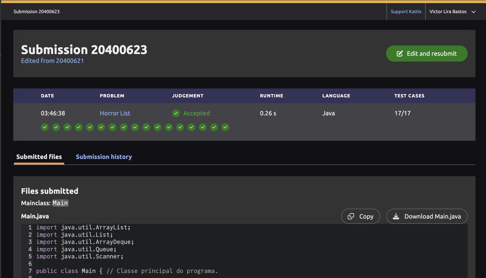

# T1 — Horror List

**Disciplina:** Resolução de Problemas com Grafos, UNIFOR.  
**Professor:** Prof. Me. Ricardo Carubbi.  
**Integrantes:** Victor Lira - 1920409; Vinícius Feitosa - 2110882.  
**Linguagem:** Java.  
**Problema:** [Kattis Horror List](https://open.kattis.com/problems/horror).

## Problema, modelagem e algoritmo

Temos N filmes, uma lista S de H filmes considerados ruins e L relações de similaridade. Cada filme é um vértice e cada similaridade uma aresta não direcionada, sem peso. O grafo pode ser desconexo.

Para cada filme, calculamos a **menor distância até algum filme da lista**: `HI(v) = min dist(v,s), s ∈ S`. Depois escolhemos o **maior desses índices**. Em empate, o menor ID. Um filme sem caminho até S tem índice infinito. Assim, primeiro minimizamos a distância de cada candidato até a lista e depois maximizamos o índice entre candidatos.

A solução usa **BFS multi-origem**: todos os filmes de S entram inicialmente na mesma fila FIFO, com distância zero. A descoberta por níveis garante as menores distâncias. A DFS estudada no Marco 3 encontra caminhos e alcançabilidade, mas não garante caminhos mínimos em um grafo não ponderado geral.

## Estrutura da entrega

A entrega está em `T1/` dentro do repositório `victorlirabastos/RPG`:

```text
T1/
├── README.md
├── acompanhamento/
│   ├── marco-1.md
│   ├── marco-2.md
│   ├── marco-3.md
│   ├── marco-4.md
│   └── revisao-feedback.md
├── src/
│   └── Main.java
├── evidencias/
│   └── accepted.png
├── apresentacao/
│   └── apresentacao.pdf
├── dados/
│   └── casos-de-teste.txt
└── testes/
    ├── verificar.py
    └── resultado.txt
```

`Main.java` é autossuficiente. As classes `Main`, `Graph` e `BreadthFirstPaths` estão no mesmo arquivo. As coleções `List`/`ArrayList` e `Queue`/`ArrayDeque`, além de `Scanner`, pertencem à biblioteca padrão Java. O executor em `testes/` valida a solução e não é enviado ao Kattis. O PPTX editável e o material de estudo também ficam fora deste pacote.

## Compilação e execução

Requer JDK 8 ou superior. Para obter a entrega e entrar na pasta correta:

```sh
git clone https://github.com/victorlirabastos/RPG.git
cd RPG/T1
```

Se já está na raiz do repositório RPG, execute `cd T1`. Todos os comandos abaixo partem de `RPG/T1`:

```sh
mkdir -p build
javac -encoding UTF-8 -d build src/Main.java
java -cp build Main
```

Depois do último comando, cole **somente a entrada de um caso** de [casos-de-teste.txt](dados/casos-de-teste.txt). Não cole rótulos como ENTRADA/SAIDA. O programa imprime o ID e termina. Execute novamente para outro caso. Alternativamente, salve essa entrada em um arquivo temporário e use `java -cp build Main < entrada.txt`.

Exemplo de entrada:

```text
7 2 6
0 5
0 1
1 2
2 3
3 4
4 5
3 6
```

Saída: `6`. A pasta `build` e qualquer entrada temporária são geradas apenas para execução local e não integram a entrega. No Kattis, enviar somente `src/Main.java`, classe principal `Main`.

## Representação e implementação de referência

A representação real é `List<Integer>[] adj`, com uma `ArrayList<Integer>` por vértice. `Graph.addEdge(v,w)` acrescenta w à lista de v e v à lista de w. A iteração preserva a **ordem de inserção**. `Scanner.nextInt()` lê os inteiros separados por espaços ou quebras de linha.

A referência é **Robert Sedgewick e Kevin Wayne, Algorithms, 4ª edição**, disponibilizada pelo professor: [Graph](https://github.com/carubbi/RPG/blob/a3df01a7931344129dc5d7e16f6525ecc24a664b/algs4-java/algs4/Graph.java), [BreadthFirstPaths](https://github.com/carubbi/RPG/blob/a3df01a7931344129dc5d7e16f6525ecc24a664b/algs4-java/algs4/BreadthFirstPaths.java) e [DepthFirstPaths](https://github.com/carubbi/RPG/blob/a3df01a7931344129dc5d7e16f6525ecc24a664b/algs4-java/algs4/DepthFirstPaths.java).

| O que foi mantido ou adaptado | Motivo |
|---|---|
| Graph com listas de adjacência e arestas nos dois sentidos | Similaridade bidirecional com espaço O(V+E) |
| ArrayList em lugar da Bag da referência | Usar a biblioteca padrão, preservando ordem de inserção |
| Queue implementada por ArrayDeque | Fila FIFO da biblioteca padrão, sem fila encadeada própria |
| BreadthFirstPaths com marked, edgeTo e distTo | Registrar descoberta, predecessor e menor distância |
| Construtor multi-origem já oferecido pela referência | Calcular o mínimo até toda a Horror List em uma busca |
| Scanner para N, H, L, origens e pares | Ler o formato de entrada do Kattis |
| Main, Graph e BreadthFirstPaths no mesmo arquivo | Submeter um arquivo autossuficiente, sem algs4 externo |
| Integer.MAX_VALUE para não alcançados | Representar índice infinito |
| IDs crescentes e atualização apenas com `>` | Maximizar HI e preservar o menor ID em empates |

A Main usa o construtor com várias origens. A classe também conserva o construtor de origem única, `hasPathTo`, `distTo` e `edgeTo`. Os predecessores são armazenados, embora a saída peça somente o ID e não reconstrua caminhos. Nas raízes e nos não alcançados, `edgeTo` conserva o valor padrão 0, sem significado de predecessor.

BFS multi-origem não é um algoritmo novo do grupo: já existe na referência. A adaptação aplica esse recurso ao Horror Index e integra entrada, infinito e desempate. O arquivo fornecido da submissão foi adotado integralmente, sem modificar seus bytes.

## Complexidade: de onde vem O(V+E)

Aqui V=N, E=L e H<V.

| Etapa | Tempo no pior caso | Motivo |
|---|---|---|
| Criar listas e ler as relações | O(V+E) | V listas e duas inserções amortizadas O(1) por aresta |
| Inicializar distâncias e fontes | O(V+H) = O(V) | Vetores de V posições e H fontes |
| Executar BFS | O(V+E) | Cada vértice enfileirado no máximo uma vez e cada aresta examinada no máximo duas vezes |
| Escolher a resposta | O(V) | Uma varredura dos IDs |

A BFS é a etapa central e uma das mais custosas assintoticamente; **a construção tem o mesmo limite O(V+E)**. Não houve medição isolada que permita afirmar qual consumiu mais tempo real. Somando as etapas, o total permanece **O(V+E)**. Os laços da BFS não multiplicam V por E, porque não percorremos todas as arestas novamente para cada vértice, apenas sua lista de vizinhos.

**Espaço do grafo:** O(V+E), com V listas e 2E entradas. **Espaço adicional da busca:** O(V), pelos vetores e pela fila. **Espaço total:** O(V+E). O algoritmo trabalha com inteiros limitados pelo enunciado.

## Marcos, testes e evidências

- [Marco 1](acompanhamento/marco-1.md): enunciado, restrições, modelagem e hipótese.
- [Marco 2](acompanhamento/marco-2.md): representação real da solução e medidas estruturais.
- [Marco 3](acompanhamento/marco-3.md): execução manual da DFS, tempos, predecessores e aplicabilidade.
- [Marco 4](acompanhamento/marco-4.md): BFS, escolha, integração, correção e validação.

[Casos de teste](dados/casos-de-teste.txt) contém 10 entradas completas: 2 exemplos oficiais e 8 casos de estudo, além da descrição de 3 limites. A revisão final reexecutou o código integral fornecido da submissão 20400623: **113/113 casos aprovados**, incluindo 100 grafos aleatórios comparados com Floyd–Warshall (semente 20260908). O oráculo pertence somente ao teste externo.

### Evidência da submissão de Victor



A captura original, sem edição, corresponde à submissão [20400623](https://open.kattis.com/submissions/20400623), conta **Victor Lira Bastos**, problema **Horror List**, linguagem **Java**, resultado **Accepted, 17/17, 0,26 s**. O arquivo integral fornecido por Victor foi recuperado do anexo da conversa e copiado byte a byte para `src/Main.java`. A divergência entre documentação e implementação foi resolvida. A entrega contém somente essa evidência. Os 17 testes do Kattis são distintos dos 113 testes locais; não houve nova submissão nesta revisão.

### Reexecutar a validação

Com Python 3 e o JDK disponíveis, dentro de `RPG/T1`:

```sh
python3 testes/verificar.py
```

O executor compila a Main em uma pasta temporária, lê os dez casos diretamente do arquivo preservado, gera os três limites e os cem grafos com a semente documentada, e compara os aleatórios com Floyd–Warshall. Uma divergência termina com erro e mostra a entrada. Resultado desta revisão: [testes/resultado.txt](testes/resultado.txt).

## Apresentação

[Apresentação em PDF](apresentacao/apresentacao.pdf): oito slides no visual institucional: capa com logo UNIFOR, subcapa com identificação e matrículas, Introdução, Objetivo, Modelagem do problema como um grafo, Representação computacional, DFS x BFS e Validação. Todos os slides incluem referências no rodapé. Roteiro planejado para 4min50s, com margem até 5 minutos. [Template de referência](https://github.com/carubbi/RPG/blob/a3df01a7931344129dc5d7e16f6525ecc24a664b/mat-didatico/trabalhos/template/template_UNIFOR.pptx).

O PDF foi atualizado para a representação com ArrayList, Scanner, ArrayDeque, os vetores da BFS e a submissão 20400623, preservando os oito slides e o formato institucional. O [registro da revisão](acompanhamento/revisao-feedback.md) inclui roteiro para ensaio de 4min50s.

## Uso de IA

Foi utilizado **ChatGPT e Codex, da OpenAI**, como apoio ao estudo, à organização e revisão dos documentos, à conferência de consistência, aos testes locais e à atualização da apresentação. Nesta revisão, o `Main.java` integral fornecido por Victor e a captura de Accepted foram copiados sem alterações de conteúdo. Cada integrante deve compreender, testar e justificar o material apresentado.

## Registro da consolidação

O [registro da revisão](acompanhamento/revisao-feedback.md) documenta a substituição pelo código integral da submissão 20400623, sua identificação por SHA-256 e a auditoria final. A instância comum preserva a aresta `(3,6)`. As simulações seguem a ordem de inserção da ArrayList. O repositório da dupla não foi alterado.
